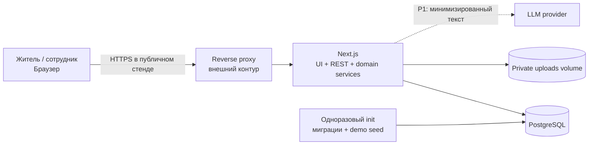
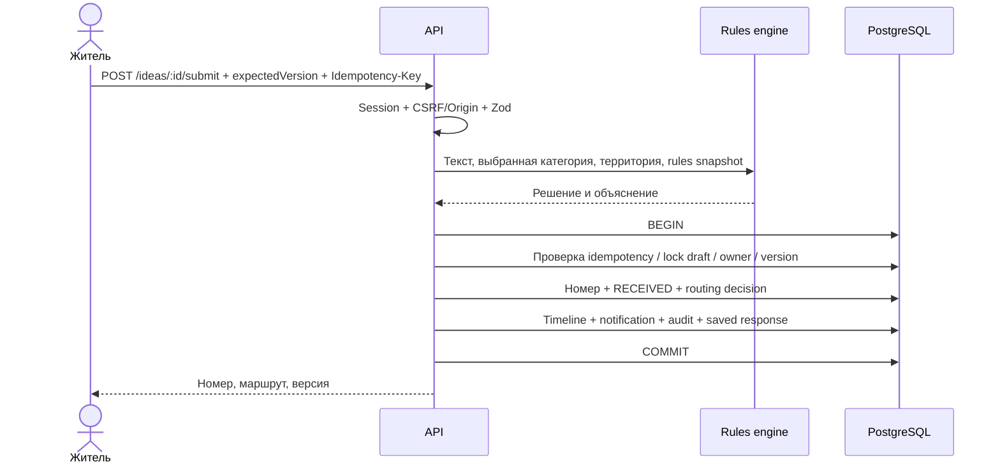

# 02. Архитектура и технические решения

## 1. Основной выбор

**Модульный монолит с контрактными границами.** Один TypeScript-проект, одно приложение Next.js, одна PostgreSQL. Архитектурная глубина достигается явными инвариантами, транзакциями, контролем доступа и независимым модулем маршрутизации, а не количеством микросервисов.

Предлагаемый стек: Node.js 24; Next.js App Router с Node runtime; React; TypeScript strict; Tailwind CSS; компоненты на доступных UI-примитивах; Zod для схем; Drizzle ORM + `pg`; PostgreSQL 17; Vitest и Playwright. Это выбранные базовые семейства, **не заявление о самых новых версиях**. Агент A проверяет совместимость актуальных патчей, фиксирует точные зависимости в lockfile и записывает реально использованные версии.

Базовый пакетный менеджер — **npm**: один `package-lock.json`, установка в CI через `npm ci`. Не добавлять второй lockfile.

Обоснование self-hosting, миграций и Compose: источники S1–S3 в [12_SOURCES_ASSUMPTIONS.md](12_SOURCES_ASSUMPTIONS.md). Для кабинетов выбирается динамический рендеринг без публичного кеширования персонализированных ответов.

## 2. Схема контейнеров



Локально браузер обращается к loopback-порту приложения без внешнего proxy. В публичном стенде HTTPS и ограничения тела запроса на proxy обязательны. Proxy может предоставляться окружением; это не повод считать его уже настроенным.

P0: два постоянных процесса. `init` завершается после успешных миграций/seed. P1-фоновая AI-обработка добавляет worker, но не требуется для базового запуска.

## 3. Слои приложения

```text
HTTP / страницы / формы
         ↓
Application services: submitIdea, changeStatus, assignIdea, respondToClarification
         ↓
Domain: policy, transitions, routing rules, invariants
         ↓
Repositories + UnitOfWork + FileStorage + optional AiProvider
         ↓
PostgreSQL / закрытый volume / внешний API
```

Route handler проверяет формат запроса и сессию, вызывает сервис, преобразует результат в HTTP. Он не содержит собственную альтернативную логику статусов. React-компонент не обращается к ORM. Общие Zod-схемы не импортируют серверные секреты или драйвер БД.

Один и тот же сервис используется независимо от того, вызван он HTTP endpoint, seed-инструментом или тестом. Исключение — seed, которому нельзя обходить ограничения в публичном API.

## 4. Модули и ответственность

| Модуль | Ответственность | Чего не делает |
|---|---|---|
| identity | Регистрация, пароль, сессия, роль и организация | Не принимает роль из формы |
| ideas | Черновик, отправка, чтение, поиск | Не решает доступ самостоятельно в UI |
| workflow | Переходы, ответственный, уточнение, результат | Не отправляет произвольные внешние письма |
| routing | Чистая классификация и выбор маршрута из справочника | Не вызывает SQL и не меняет статусы |
| attachments | Валидация, закрытое хранение, выдача после авторизации | Не публикует файлы в `public/` |
| notifications | Внутренние уведомления, прочтение | Не обещает доставку SMS |
| audit | Служебные события, техническая прослеживаемость | Не хранит пароли, cookies, исходные файлы |
| ai | Адаптер AI, таймауты, проверка схемы, P1 | Не имеет права назначать статус/орган напрямую |
| analytics | Только агрегаты доступной области | Не раскрывает малые частные выборки публично |

## 5. Структура репозитория приложения

```text
sevens/
  AGENTS.md
  docs/                         # продукт, архитектура, API, безопасность, запуск и приёмка
    prompts/                    # промпты runtime AI
    fixtures/                   # исходные каталоги для seed
    design/                     # текущий дизайн, карта и геоданные
  fixtures/                     # только синтетика
  src/
    app/
      (public)/page.tsx
      (auth)/login/page.tsx
      (auth)/register/page.tsx
      (citizen)/my/ideas/page.tsx
      (citizen)/my/ideas/new/page.tsx
      (citizen)/my/ideas/[id]/page.tsx
      (staff)/staff/ideas/page.tsx
      (staff)/staff/ideas/[id]/page.tsx
      (admin)/admin/routing/page.tsx
      api/v1/.../route.ts
      api/health/live/route.ts
      api/health/ready/route.ts
      layout.tsx
      globals.css
    components/ui/
    features/citizen/
    features/staff/
    features/shared/
    contracts/                  # enum, Zod, request/response DTO
    server/
      auth/
      db/
      repositories/
      services/
      policies/
      storage/
      notifications/
      audit/
      ai/
    domain/
      routing/
      workflow/
    lib/                        # безопасные общие утилиты
    locales/ru.json
    locales/kk.json
  db/migrations/
  scripts/                      # migrate, seed, health/smoke
  tests/unit/
  tests/integration/
  tests/e2e/
  docs/reports/
  compose.yaml
  Dockerfile
  .env.example
  package.json
  package-lock.json
```

Реальные файлы приложения создаются coding-командой. Дерево выше — целевое, а не список уже реализованного.

## 6. Процесс подачи: критическая транзакция



Правила выполняются до транзакции на версии входного текста; внутри транзакции проверяется, что `expectedVersion` не изменился. Если изменился — `409 VERSION_CONFLICT`, результат предварительного расчёта не используется. В транзакции нет сетевого LLM-вызова.

Идемпотентный повтор обрабатывается **до** проверки текущей версии: тот же ключ с тем же запросом возвращает сохранённый результат. Иначе успешный повтор после изменения версии ошибочно выглядел бы конфликтом.

## 7. Процесс смены статуса

1. Сервер устанавливает пользователя из сессии и загружает его актуальную организацию.
2. В транзакции блокирует идею, проверяет доступ, `expectedVersion`, допустимость перехода, наличие ответственного и обязательного текста.
3. Обновляет карточку, увеличивает `version`, создаёт событие и связанный публичный комментарий.
4. Создаёт внутреннее уведомление автору и аудит; сохраняет идемпотентный ответ.
5. Подтверждает транзакцию. Клиент перезапрашивает карточку и список.

Сбой между шагами не должен оставлять новый статус без истории или историю без статуса. UI не подтверждает успех до ответа сервера.

## 8. Файлы и согласованность

Файл и транзакция PostgreSQL не являются единой атомарной системой. Поэтому загрузка выполняется в ограниченный временный файл, проверяется по содержимому и размеру, перемещается под случайным storage key, затем создаётся метадата в транзакции с блокировкой идеи. При ошибке метадаты созданный файл удаляется best-effort; периодическая уборка удаляет бесхозные временные объекты старше установленного порога.

Файлы не исполняются и не разбираются LLM автоматически. Доступ — через авторизованный endpoint. В P0 скачивание как attachment; image preview допускается только для безопасно перекодированного изображения без EXIF и после той же проверки доступа.

Вложения к черновику разрешены владельцу; к `NEEDS_INFO` — автору для подготовки ответа. После изменения состояния загрузка повторно проверяет статус в БД, чтобы не прикрепить файл к уже завершённой идее из старой вкладки.

## 9. Уведомления без лишней инфраструктуры

P0: строка `notifications` создаётся в той же транзакции, что и событие. Уникальная пара `(source_event_id, recipient_id)` предотвращает дублирование. Клиент читает её обычным REST-запросом. WebSocket и message broker не нужны.

P1 email/AI: `jobs/outbox` записывается в транзакции, worker забирает задачу с ограниченным lease, выполняет действие с idempotency, фиксирует попытки и итог. `FOR UPDATE SKIP LOCKED` применяется только при реализации worker и покрывается интеграционным тестом. Нельзя имитировать надёжную фоновую работу `setTimeout` после ответа HTTP.

## 10. AI как изолированный советник

P0 отправка завершена сразу после правил. P1 AI-анализ хранится отдельно как рекомендация для конкретной `content_revision`; два этапа — классификатор и проверяющий. Внешние запросы получают минимизированный текст, коды категорий и разрешённые идентификаторы. Нет DB credentials, браузерных cookies, инструментов запуска shell или адресной книги.

Ошибочный JSON, таймаут или недоступность провайдера дают результат `UNAVAILABLE/INVALID`, а не падение подачи. Поздний ответ от старой версии текста помечается устаревшим. AI не переопределяет человеческое перенаправление и не меняет статус. Любое применение рекомендации — отдельное авторизованное действие сотрудника.

## 11. Кеширование и обновление

Справочники можно кешировать с версией. Кабинеты, карточки, контакты и файлы: `Cache-Control: private, no-store`. Не использовать общий статический кеш для ответов разных ролей. Любая оптимизация кеша должна сохранять разделение авторов и организаций.

После мутации UI инвалидирует карточку, список и уведомления. На активной вкладке применяется 10-секундный polling; на скрытой опрос приостанавливается. Видна кнопка «Обновить», а время последнего обновления не выдаётся за время поступления идеи.

## 12. Масштабирование после MVP

Сначала добавить индексы и измерить медленные запросы. Затем вынести файлы в закрытое объектное хранилище; worker сделать отдельным процессом; при нескольких app-инстансах вынести rate-limit state и обеспечить согласованную сессию/кеш. `region_id` присутствует с первого дня, но правила и права проверяются в границах региона, а не только по UI-фильтру.

Отделять микросервис следует по выявленной нагрузке или самостоятельному жизненному циклу команды, а не ради схемы защиты. Не обещать «миллионы пользователей» без замеров.

## 13. Архитектурные решения ADR

| ADR | Решение | Причина / цена |
|---|---|---|
| 001 | Модульный монолит | Меньше интеграционных отказов; дисциплина границ нужна внутри кода |
| 002 | PostgreSQL + миграции | Транзакции и ограничения; требуется запуск БД |
| 003 | Правила обязательны, AI дополнительный | Подача работает без внешнего API; сложные случаи идут человеку |
| 004 | Одна текущая организация | Понятная ответственность; вторичные темы остаются тегами |
| 005 | Частные идеи по умолчанию | Публикация не происходит случайно; витрина требует отдельного процесса |
| 006 | Серверные сессии, не JWT в localStorage | Отзыв и контроль доступа; дополнительное чтение сессии |
| 007 | Append-only события приложения | Прослеживаемость; не равно криптографически неизменяемому журналу |
| 008 | Четыре независимых coding-сеанса | Каждый может иметь своих помощников; нужен явный канал согласования |
| 009 | Один владелец схемы и один lockfile | Меньше конфликтов; общие изменения проходят через A/B |

## 14. Главные риски и противодействие

Разъезд контрактов между агентами предотвращается фиксацией DTO до параллельной реализации. Повреждение миграций — единым владельцем B и применением через init. Утечки между организациями — серверными policy и негативными тестами. Завышенная уверенность классификатора — объяснениями и очередью разбора. Сбой интернета — локальными правилами, шрифтами и файлами. Непроверенный деплой — независимым запуском из чистой копии на финальном коммите.
